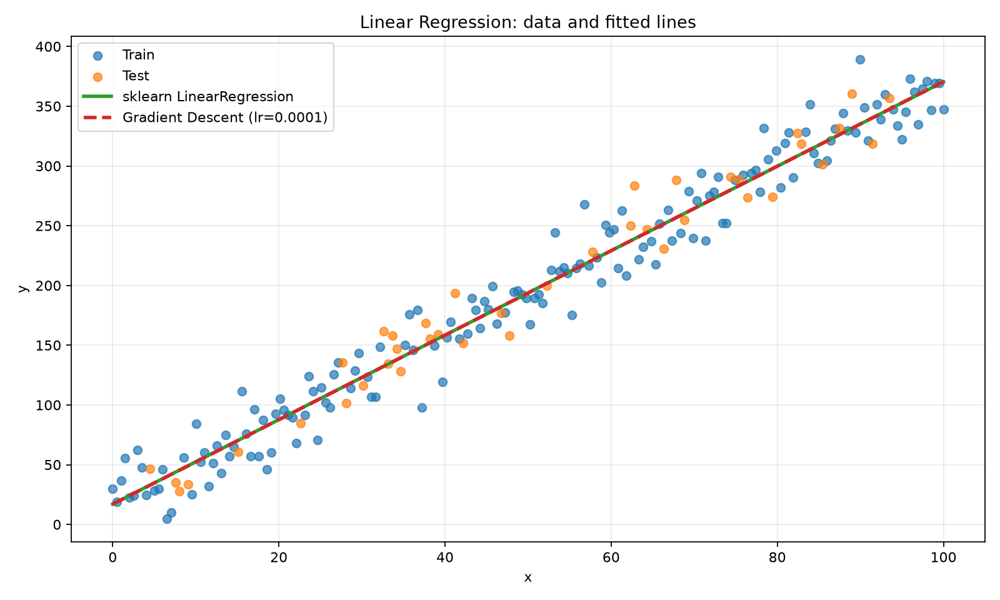
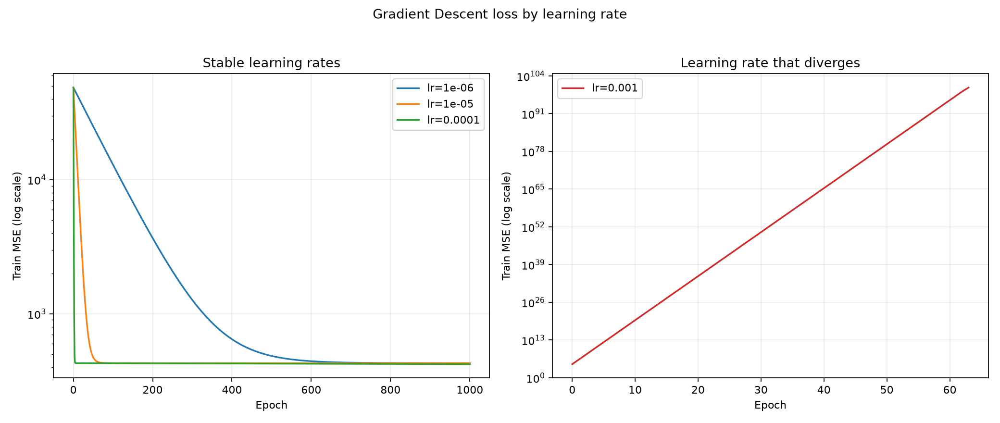

# Báo cáo Bài 2.1 — Linear Regression từ đầu

## 1. Mục tiêu và thiết lập

Dữ liệu được sinh đúng theo đề bài:

```python
np.random.seed(42)
x = np.linspace(0, 100, 200)
y = 3.5 * x + 20 + np.random.normal(0, 20, 200)
```

Sau đó dữ liệu được chia 80% train và 20% test bằng `train_test_split(..., test_size=0.2, random_state=42)`. `random_state=42` bảo đảm việc chọn các sample train/test lặp lại được.

Đã dùng hai cách train:

1. `sklearn.linear_model.LinearRegression` làm baseline.
2. Batch Gradient Descent tự viết với `w=0`, `b=0`; không dùng sklearn để train phần này.

Loss là Mean Squared Error:

\[
MSE = \frac{1}{n}\sum_{i=1}^{n}(y_i - \hat{y}_i)^2
\]

## 2. Kết quả sklearn

| Đại lượng | Giá trị |
|---|---:|
| Hệ số `w` | 3,533703 |
| Intercept `b` | 17,060662 |
| Train MSE | 352,227434 |
| Test MSE | 308,766067 |

Train MSE và Test MSE gần nhau. Test MSE thấp hơn một chút do cách chia ngẫu nhiên tạo tập test dễ hơn tập train trong lần chạy này; đây không phải bằng chứng model tốt hơn trên dữ liệu chưa thấy.

## 3. Gradient Descent tự cài đặt

Mô hình dự đoán:

\[
\hat{y} = wx + b
\]

Gradient được tính từ MSE:

\[
\frac{\partial MSE}{\partial w} = \frac{2}{n}\sum x_i(\hat{y}_i-y_i)
\]

\[
\frac{\partial MSE}{\partial b} = \frac{2}{n}\sum (\hat{y}_i-y_i)
\]

Mỗi epoch cập nhật:

\[
w \leftarrow w - lr \times dw
\]

\[
b \leftarrow b - lr \times db
\]

## 4. Thử nghiệm learning rate

Mỗi learning rate được chạy 1.000 epoch từ cùng khởi tạo `w=0`, `b=0`.

| Learning rate | w sau 1.000 epoch | b sau 1.000 epoch | Train MSE | Test MSE | Trạng thái |
|---:|---:|---:|---:|---:|---|
| 0,000001 | 3,780875 | 0,064914 | 428,270373 | 364,818509 | Ổn định nhưng rất chậm |
| 0,00001 | 3,784115 | 0,145239 | 427,488509 | 362,399701 | Ổn định nhưng rất chậm |
| 0,0001 | 3,772538 | 0,927297 | 420,690226 | 357,299432 | Ổn định, giảm loss nhanh nhất trong các giá trị hợp lệ |
| 0,001 | Giá trị rất lớn | Giá trị rất lớn | Rất lớn | Không xác định | Diverge |

`0,001` diverge vì bước cập nhật quá lớn so với độ cong của MSE trên dữ liệu có `x` trải từ 0 đến 100. Mỗi lần update vượt qua điểm thấp nhất của loss, khiến `w`, `b` và MSE tăng nhanh thay vì giảm.

Ba learning rate còn lại không diverge trong 1.000 epoch. Tuy vậy, `0,000001` và `0,00001` quá nhỏ nên gần như chưa học được intercept. `0,0001` là lựa chọn phù hợp nhất trong bốn giá trị thử, nhưng bài toán có hai tham số với thang đo khác nhau nên 1.000 epoch vẫn chưa đủ để intercept hội tụ hoàn toàn.

Để kiểm tra hội tụ đầy đủ, `0,0001` được train tiếp đến 100.000 epoch:

| Đại lượng | Gradient Descent, lr=0,0001, 100.000 epoch |
|---|---:|
| w | 3,535011 |
| b | 16,972281 |
| Train MSE | 352,229488 |
| Test MSE | 308,737406 |

Kết quả rất gần sklearn: chênh `w` khoảng 0,001308, chênh `b` khoảng 0,088381, và MSE gần như trùng nhau. Điều này kiểm chứng hàm gradient và vòng lặp train hoạt động đúng.

## 5. Biểu đồ

### Dữ liệu và đường hồi quy



Đường của Gradient Descent gần chồng lên đường sklearn sau 100.000 epoch. Các điểm không nằm đúng trên đường vì dữ liệu được thêm Gaussian noise với standard deviation 20.

### Loss theo epoch



Biểu đồ tách hai panel để đường diverge không che mất ba đường ổn định. Cả hai panel dùng trục y log. Learning rate `0,0001` giảm nhanh nhất trong nhóm ổn định; `0,001` tăng mạnh.

## 6. Trả lời câu hỏi bắt buộc

### Learning rate nào hội tụ? Trường hợp nào diverge?

Trong thời gian chạy 1.000 epoch, `0,000001`, `0,00001`, và `0,0001` đều ổn định, nhưng hai giá trị đầu hội tụ quá chậm. `0,0001` là lựa chọn tốt nhất trong bốn giá trị vì giảm loss nhanh nhất mà không diverge. `0,001` diverge vì bước cập nhật quá lớn.

### w và b học được gần 3,5 và 20 đến mức nào?

Kết quả cuối của Gradient Descent là `w = 3,535011`, chênh khoảng 0,035011 so với 3,5; `b = 16,972281`, chênh khoảng 3,027719 so với 20. Không nên kỳ vọng khớp tuyệt đối vì 200 sample chứa noise và chỉ 80% được dùng train.

Mốc tốt hơn để kiểm chứng thuật toán là so với nghiệm sklearn trên đúng tập train: Gradient Descent có `w`, `b` và MSE gần như trùng sklearn. Điều đó cho thấy sai khác với đường thật đến từ noise và tập mẫu, không phải từ lỗi Gradient Descent.

## 7. Điều đã học

- Linear Regression tìm đường thẳng giảm MSE trên dữ liệu train.
- Gradient Descent cần gradient đúng và learning rate phù hợp.
- Learning rate nhỏ không diverge nhưng có thể học quá chậm; learning rate lớn có thể diverge.
- Train MSE thấp không đủ để đánh giá; cần kiểm tra Test MSE.
- Seed, split và cấu hình được ghi rõ để experiment tái lập được.
