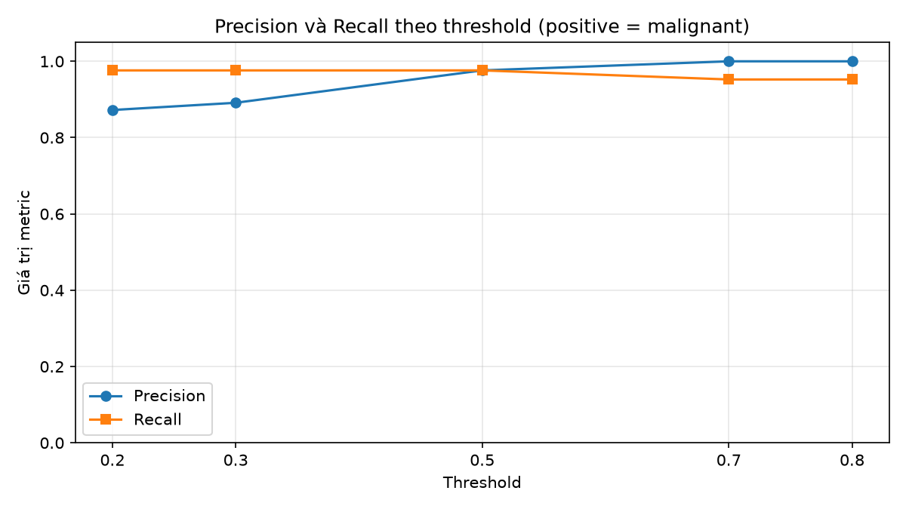

# Báo cáo Bài 2.2 — Classification và threshold

## 1. Mục tiêu và thiết lập

Thực hiện theo [đề bài gốc](https://docs.google.com/document/d/1bmBCggHgg5WIE0FH0iNsDSfu60QtCeFE/edit): dùng `load_breast_cancer()`, train Logistic Regression và đánh giá tác động của threshold.

- Dataset: 569 mẫu, 30 feature; nhãn gốc `0 = malignant`, `1 = benign`.
- Quy ước **positive = malignant (0)**, **negative = benign (1)**, thống nhất trong xác suất, TP/FP/TN/FN và Precision/Recall/F1.
- Chia train/test **80/20**, `random_state=42`, `stratify=y`: 455 mẫu train (170 malignant, 285 benign), 114 mẫu test (42 malignant, 72 benign).
- Không tạo tập validation hoặc tìm siêu tham số; năm ngưỡng được thử đúng theo đề.
- `StandardScaler` chỉ fit trên 455 mẫu train, sau đó transform train và test bằng cùng scaler.
- `LogisticRegression(solver="lbfgs", max_iter=1000, random_state=42)`; solver chạy 19 vòng lặp, không có cảnh báo hội tụ.
- Môi trường: Python 3.13, NumPy 2.5.2, pandas 3.0.5, scikit-learn 1.9.0, Matplotlib 3.11.1; cách cài và chạy trong [README](README.md).

## 2. Kết quả đánh giá ban đầu

Dùng `model.predict(X_test_scaled)` trên tập test. Precision, Recall và F1 tính cho positive bằng `pos_label=0`; Accuracy tính trên toàn bộ mẫu.

| Accuracy | Precision | Recall | F1 |
|---:|---:|---:|---:|
| 0.982456 | 0.976190 | 0.976190 | 0.976190 |

Confusion Matrix: **hàng = nhãn thật, cột = dự đoán**, thứ tự `[negative, positive] = [1, 0]`:

| Nhãn thật / Dự đoán | Benign (negative) | Malignant (positive) |
|---|---:|---:|
| Benign (negative) | TN = 71 | FP = 1 |
| Malignant (positive) | FN = 1 | TP = 41 |

Model phát hiện 41/42 mẫu malignant, bỏ sót 1 mẫu và gắn nhầm 1/72 mẫu benign thành malignant. Accuracy cao vẫn cần đọc cùng FN và Recall để thấy các trường hợp bị bỏ sót.

## 3. Kết quả năm threshold

Lấy cột xác suất của nhãn positive (0) theo `model.classes_` trong `predict_proba`. Tự áp quy tắc: **P(positive) >= threshold → positive**, còn lại → negative. Giữ nguyên model và 114 mẫu test khi thay ngưỡng.

| Threshold | TP | FP | TN | FN | Precision | Recall | F1 |
|---:|---:|---:|---:|---:|---:|---:|---:|
| 0.2 | 41 | 6 | 66 | 1 | 0.872340 | 0.976190 | 0.921348 |
| 0.3 | 41 | 5 | 67 | 1 | 0.891304 | 0.976190 | 0.931818 |
| 0.5 | 41 | 1 | 71 | 1 | 0.976190 | 0.976190 | 0.976190 |
| 0.7 | 40 | 0 | 72 | 2 | 1.000000 | 0.952381 | 0.975610 |
| 0.8 | 40 | 0 | 72 | 2 | 1.000000 | 0.952381 | 0.975610 |

TP + FN luôn bằng 42; TN + FP luôn bằng 72. Tại 0.5, dự đoán trùng với `model.predict` trong lần chạy này.

## 4. Nhận xét từ kết quả

- Tại **0.2**, model phát hiện 41/42 positive, bỏ sót 1, báo động nhầm 6/72 negative; Precision = 0.872340, Recall = 0.976190.
- Tại **0.8**, model phát hiện 40/42 positive, bỏ sót 2, báo động nhầm 0/72 negative; Precision = 1.000000, Recall = 0.952381.
- Khi nâng ngưỡng từ 0.2 lên 0.8, FP thay đổi từ 6 thành 0, trong khi FN thay đổi từ 1 thành 2. Cần xét đồng thời hai kiểu lỗi thay vì chỉ dựa vào một metric.
- Các ngưỡng có thể cho cùng số đếm nếu không có xác suất mẫu test nằm giữa chúng. Precision không được bảo đảm tăng ở mọi ngưỡng; kết luận phải dựa vào bảng. Recall không tăng khi nâng threshold trên cùng một tập xác suất.

## 5. Câu hỏi bắt buộc: nếu positive là malware trong AV endpoint

Đây là **giả định để giải thích ý nghĩa của threshold**: positive tương ứng malware, negative tương ứng phần mềm sạch. Dữ liệu thực nghiệm vẫn là Breast Cancer, nên các số dưới đây chỉ minh họa, không phải kết quả kiểm thử antivirus.

**Threshold thấp:** chỉ cần xác suất malware tương đối thấp đã bị gắn nhãn positive. Antivirus có thể phát hiện thêm malware, giảm bỏ lọt (FN), nhưng cũng có thể tăng báo động nhầm (FP). Người dùng có thể bị cảnh báo nhiều, ứng dụng sạch bị chặn hoặc cách ly, gián đoạn công việc và mất thời gian xử lý. Với kết quả minh họa tại 0.2: phát hiện 41 positive, bỏ sót 1 và cảnh báo nhầm 6 negative.

**Threshold cao:** cần xác suất malware lớn hơn mới gắn nhãn positive. FP giảm hoặc giữ nguyên, giảm cảnh báo/chặn nhầm và ít làm phiền người dùng hơn; đổi lại có thể tăng FN, khiến malware không bị phát hiện hoặc chặn và tiếp tục gây hại. Với kết quả minh họa tại 0.8: phát hiện 40 positive, bỏ sót 2 và cảnh báo nhầm 0 negative.

Chọn threshold là cân nhắc giữa chi phí bỏ lọt malware và chi phí làm gián đoạn người dùng do báo động nhầm. Precision và Recall giúp thấy sự đánh đổi; F1 tóm tắt hai metric nhưng không thay thế việc đánh giá hậu quả FP/FN. Bài này so sánh năm ngưỡng được giao trên test, không khẳng định một ngưỡng tối ưu triển khai từ kết quả này.

## 6. Đối chiếu yêu cầu nộp

- [Notebook](assignment_classification.ipynb) đã lưu output của toàn bộ code, đủ năm metric ban đầu, bảng đúng năm threshold và biểu đồ Precision/Recall.
- Report có kết quả và phân tích tình huống AV endpoint.
- [README](README.md) ghi mục tiêu, cài đặt, cách chạy, kết quả chính, điều học được; seed và split được ghi rõ.
- Kết quả được tính từ dữ liệu; không hard-code dự đoán hoặc metric trong code. Số liệu trong report là bản ghi của lần chạy notebook.
- Đã kiểm tra thực thi toàn bộ notebook trong môi trường riêng cài theo README và đối chiếu số đếm bằng điều kiện trên nhãn thật/dự đoán.

Người nộp cần tự đọc, viết lại hoặc điều chỉnh nhận xét theo cách hiểu của mình và giải thích được code trong buổi review, theo hướng dẫn chung của đề.
